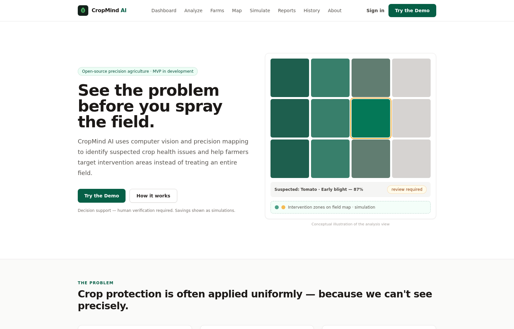
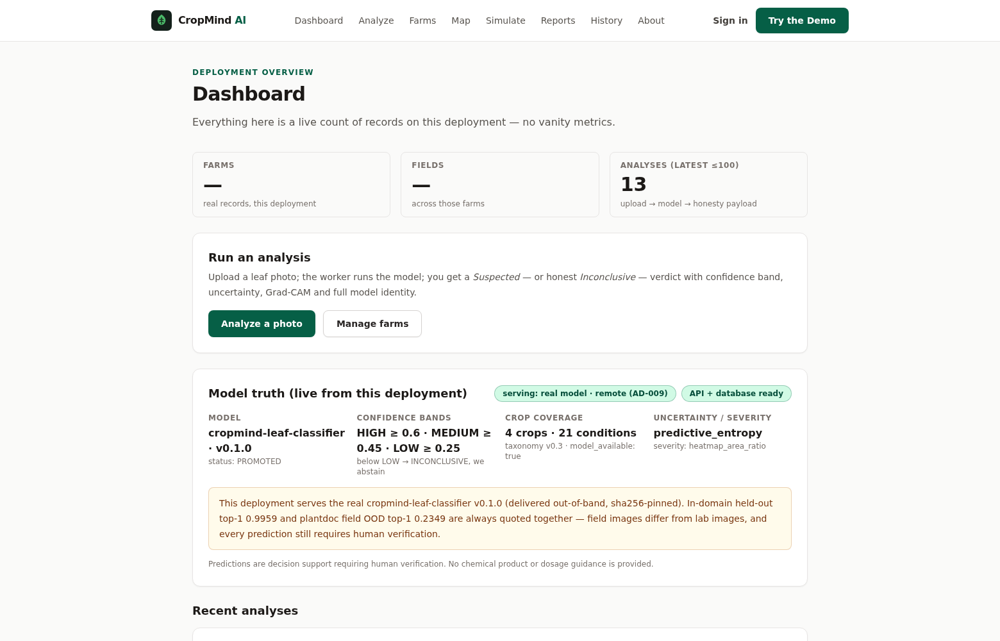
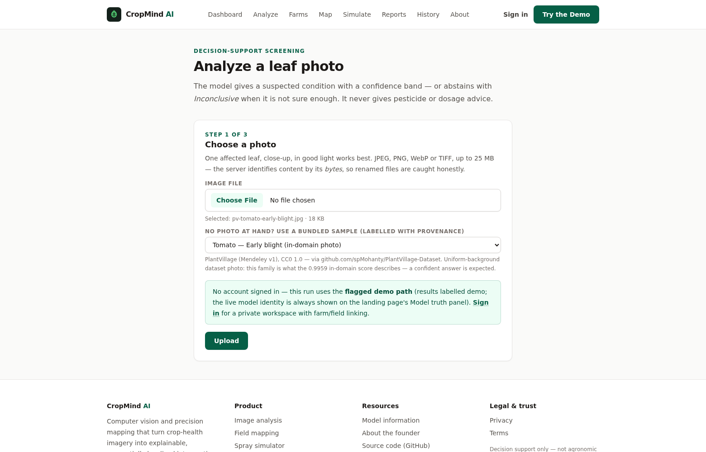
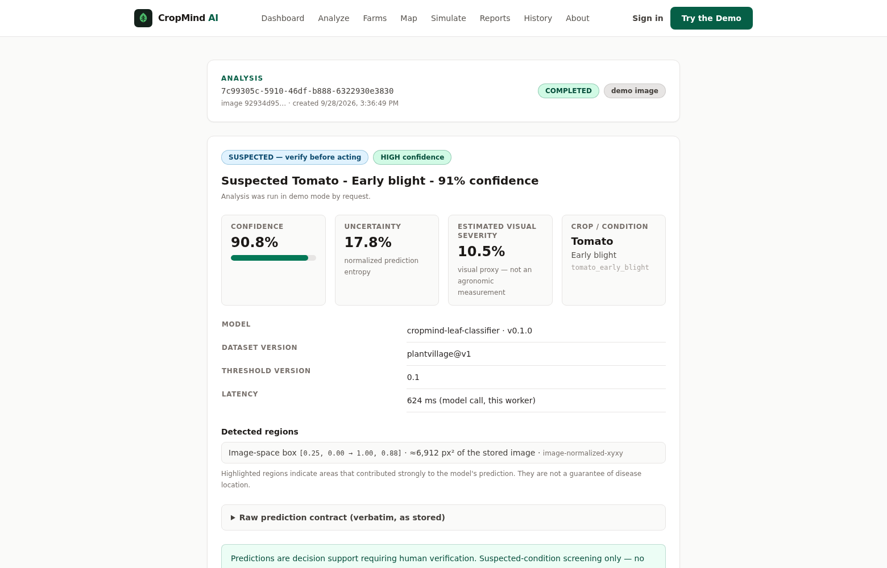
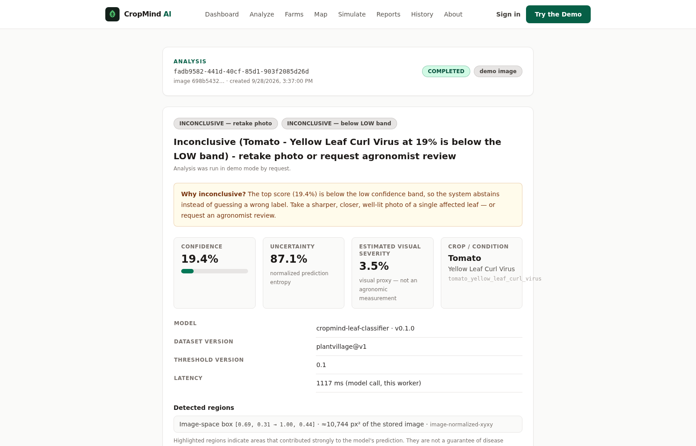
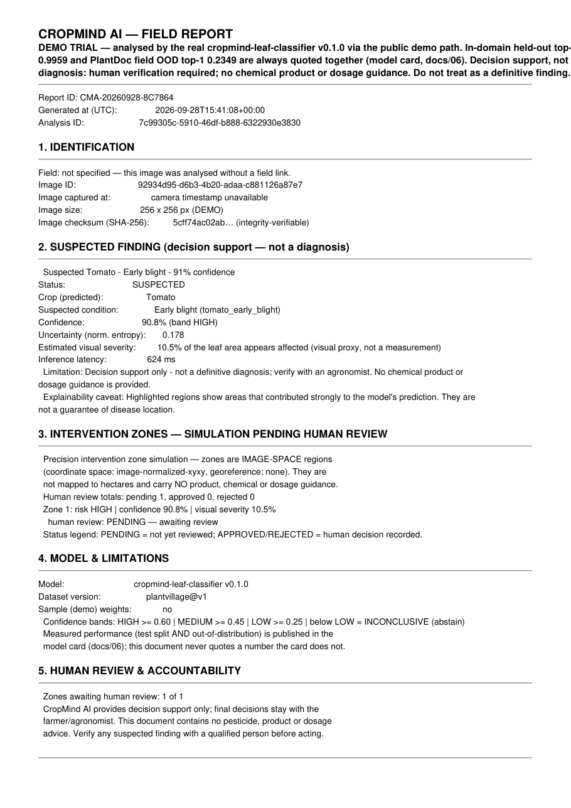
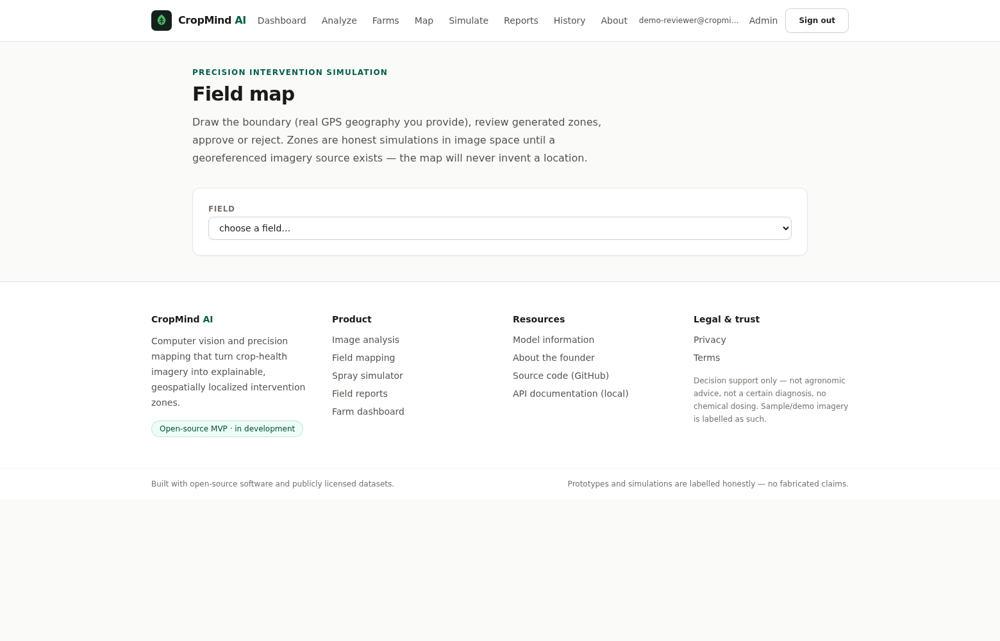
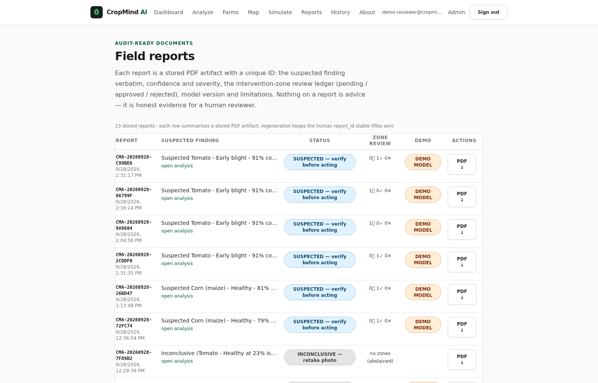
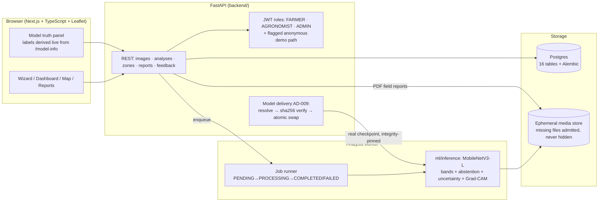
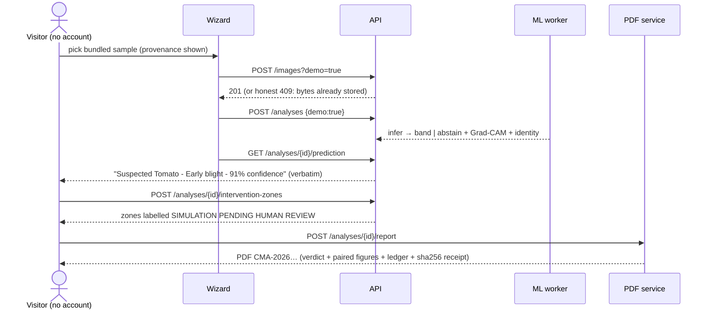

<div align="center">
  
  <h1>CropMind AI</h1>
  <p><strong>The crop-health AI that tells you when it doesn't know.</strong></p>
  <p>Open-source precision agriculture: suspected-condition screening with calibrated
  confidence bands, explainability, human-reviewable intervention zones, and
  audit-ready PDF evidence — <em>decision support, never a dressed-up guess.</em></p>

  <p>
    <a href="https://github.com/Vishwa-cloud25S/cropmind-ai/actions/workflows/ci.yml"></a>
    <a href="LICENSE"></a>
    <a href="https://cropmind-ai-theta.vercel.app"></a>
    
  </p>
</div>

---

> **Most agtech demos can't say "I don't know." This one refuses to guess.**
> Point it at a real field photo and it will *abstain* — `Inconclusive (… below the LOW
> band) - retake photo or request agronomist review` — rather than invent a confident
> disease label. That refusal is the product.

## ⚡ Hook highlights (all receipts, no slogans)

- **It abstains on purpose.** Below the LOW band (0.25) the answer is *Inconclusive* with retake/review guidance — verified live on a real field photo at 19% (screenshot below).
- **It publishes its own limits.** In-domain held-out top-1 **0.9959** and PlantDoc field-OOD **0.2349** are printed **side by side on every surface** — the UI banner, every PDF, the API, the model card. A model that hides its field performance is a liability; ours names it.
- **Real model in production.** The live demo serves the evaluated cropmind-leaf-classifier **v0.1.0**, delivered out-of-band with **sha256 integrity pinning** (AD-009) — never committed to git. `GET /model-info` shows exactly which weights answer you, right now.
- **Files win over console.** Every run ends in a uniquely-IDed PDF field report (e.g. **CMA-20260928-9A9684**) with the verdict verbatim, both evaluation figures, the zone review ledger, and a SHA-256 integrity receipt for the source image.
- **Honesty by design, everywhere displayed.** Verbatim `Suspected … — N% confidence` phrasing; demo/sample/real weights are independently flagged on API, UI and PDF; global content-dedupe refuses byte-identical re-uploads *and explains why*; simulations are labelled SIMULATION.
- **No account needed.** The full money-loop — pick a bundled, provenance-labelled sample → verdict → zones → PDF — runs anonymously on the flagged demo path. We demoed it to ourselves, caught **three** flow-killing bugs, fixed them, and pinned regressions with 8 new tests.

## 🚀 Try it in 3 minutes (live public demo)

**[https://cropmind-ai-theta.vercel.app](https://cropmind-ai-theta.vercel.app)** · API: `https://cropmind-demo-api.onrender.com`
*(free tier — sleeps when idle; the first action after a nap can take ~a minute while it wakes, and the UI says so)*

1. **Dashboard** — watch the *Model truth* panel derive its claim live from `/model-info` (`serving: real model · remote (AD-009)`), with both accuracy figures next to it.
2. **Analyze** — no photo at hand? Pick a **bundled sample** (each labelled with source, license, and *what it should teach you*).
3. Read the verdict: **verbatim** phrasing, confidence band, uncertainty, Grad-CAM *with its caveat*, model identity. Feed it the field sample and watch it **abstain**.
4. **Map → zones → PDF** — generate simulation zones, review one, download the `CMA-…` field report: verdict verbatim + paired figures + review ledger + SHA-256 receipt.
5. Try to break it: re-upload the same file (dedupe 409, explained) or a screenshot of a spreadsheet — and read [*what honestly happens*](demo/rehearsal-notes.md#r3--adversarial-text-image-financial-soup).

## 📊 Results — measured, paired, reproducible

| Claim | Value | Where it's enforced |
|---|---|---|
| In-domain held-out top-1 | **0.9959** | Model card + API `/model-info` + UI banner + every PDF — always quoted **with** ↓ |
| PlantDoc field-OOD top-1 | **0.2349** (shortfall, published as-is) | same block; the pair travels together by rule |
| CPU latency (eval rig) | **p95 110.4 ms** | `reports/model_evaluation/` (generated, never hand-edited) |
| Confidence bands | HIGH ≥ 0.60 · MEDIUM ≥ 0.45 · LOW ≥ 0.25 · below → abstain | config-pinned (`ml/configs/model.yaml`), test-pinned |
| Live verdicts (2026-09-28, real model) | Tomato early blight **91% HIGH** · Potato late blight **77% HIGH** · field photo → **INCONCLUSIVE 19%** | [demo/walkthrough-checklist.md](demo/walkthrough-checklist.md) |
| PDF field reports (receipts) | `CMA-20260928-9A9684` · `CMA-20260928-C99BE6` · `CMA-20260928-8C7864` | [demo/rehearsal-notes.md](demo/rehearsal-notes.md) |
| Tests | backend **152** (+3 live-gate vs production) · frontend **96** · ml **113** · sim **10** | CI: backend · frontend · ml · docker — 4/4 green |
| Docs | numbered set 01–16 + datasets register + demo kit + business package | integrity-pinned by tests |

## 🖼 See it working

*Captured 2026-09-28 from the production build against the live deployment serving the real model v0.1.0. The demo flags visible in every frame are the honesty system working — these images demonstrate the workflow, and the measured numbers above live with their context in the [model card](docs/06-model-card.md).*

| | |
|---|---|
|  |  |
|  |  |
|  |  |
|  |  |

More: [model truth close-up](docs/assets/screens/model-truth.png) · [live model information page](docs/assets/screens/model-information.png) · [analysis history](docs/assets/screens/analysis-history.png) · [spray-plan simulation](docs/assets/screens/simulate.png)

## 🏗 Architecture



| Layer | What it does | Honesty hooks |
|---|---|---|
| `frontend/` (Next.js, TS, Tailwind, Leaflet) | wizard, dashboard, field map + zones, reviews, reports | every model claim derived from `/model-info`; demo/sample/real flags on screen |
| `backend/` (FastAPI, SQLAlchemy 2, Alembic, ReportLab) | REST API, auth/roles, audit log, dedupe, PDF generation, model delivery (AD-009) | verbatim phrasing; path-vs-weights demo flags; sha256 receipts; refuse-to-serve on integrity mismatch |
| `ml/` (MobileNetV3-L, torch CPU) | data pipeline, training, evaluation, inference, Grad-CAM | bands from config, abstain-below-LOW, OOD published, per-prediction identity |
| `simulation/` (pure stdlib) | spray-plan + route/area/time simulation | labelled SIMULATION everywhere; no dosage advice, ever |
| `demo/` | samples (provenance- and byte-pinned), 3-min script, walkthrough evidence, acceptance sweep | rehearsal notes carry real timings and one documented honest miss |

## 🔄 The golden path (and a reviewer's loop)



Signed-in loop (FARMER/AGRONOMIST): farm/field CRUD with drawn boundaries → analyses
linked to fields → map review (approve/reject with notes) → the ledger lands on the PDF →
feedback feeds the future data strategy. Business workflow map: [docs/03](docs/03-user-workflows.md).

## What it is — and honestly is not

A full-stack precision-agriculture MVP: smartphone/drone image → suspected-condition
screening → confidence & uncertainty → localization → severity proxy → explainability →
field mapping → intervention-zone simulation → savings simulation → human review →
PDF evidence report.

It does **not** diagnose with certainty; it never prescribes products/brands/dosages;
savings are simulations; coverage is an explicit small crop/condition set
(`/supported-crops`); the drone/spray loop is simulated. Known limits are a first-class
document: [docs/15-limitations.md](docs/15-limitations.md).

## Repository layout

```
cropmind-ai/
├── backend/          # FastAPI + SQLAlchemy 2 + Alembic (Phase 1, 5, 10)
├── frontend/         # Next.js + TypeScript + Tailwind + Leaflet (Phase 1, 6, 7)
├── ml/               # data / preprocessing / training / evaluation / inference /
│                     # explainability / models / configs / notebooks
├── data/             # raw / processed / annotations / splits  (never committed)
├── simulation/       # drone + precision-spray simulators (Phase 8)
├── docs/             # product, architecture, datasets, model/data cards, roadmap
├── demo/             # demo kit: samples (provenance-pinned), 3-min script, walkthrough evidence, pitch outline, acceptance sweep (Phase 15)
├── business/         # business plan, market, pricing, financials, risks, endorsement evidence map (Phase 14)
├── reports/          # generated model-evaluation reports
└── .github/          # CI workflows (Phase 1)
```

## Quickstart

Requires Docker (everything: frontend, API, worker, Postgres):

```bash
cp .env.example .env          # OPTIONAL — only to override defaults; demo mode boots with no .env at all
docker compose up --build
```

- Web app → http://localhost:3000 — real UI: `/dashboard`, `/analyze` (upload → analysis wizard),
  `/analyses` (history), `/farms`, `/map` (boundaries, zones, review + exports),
  `/simulate` (spray-plan SIMULATION), `/reports` (PDF field reports), `/model-information`,
  `/login` `/register` `/settings` (accounts), `/admin` (ADMIN console)
- **Accounts (Phase 10):** register on first visit — the first account on a fresh deployment becomes
  **ADMIN** (documented bootstrap), later accounts are FARMER. Without an account the app still runs
  the flagged **demo path** (demo=true uploads/analyses only). Sign-out revokes the token server-side.
- API + OpenAPI docs → http://localhost:8000/docs
- `GET /health`, `GET /health/ready`, `GET /supported-crops`, `GET /model-info`
- **End-to-end demo (Phase 5):** `POST /images` a leaf photo → `POST /analyses {"image_id": "…"}` (202) →
  poll `GET /analyses/{id}` → `GET /analyses/{id}/prediction`. The worker applies the
  clearly-flagged **DEMO sample model** unless `MODEL_CHECKPOINT` points at a trained run
  (`.env`, e.g. `/runs/20260808-180238-0.1.0/checkpoint.pt` — `./runs` is mounted read-only at `/runs`).

Local dev without Docker (needs local Postgres for `/health/ready` to go green):

```bash
cd backend  && python -m venv .venv && . .venv/bin/activate && pip install -r requirements.txt
uvicorn app.main:app --reload          # → :8000
python -m app.workers.analysis_worker  # second shell: same backend venv; MODEL_CHECKPOINT unset = DEMO model

cd frontend && npm install && npm run dev   # → :3000
```

Tests and lint:

```bash
cd backend     && python -m pytest -q && ruff check .
cd frontend    && npm run lint && npm run typecheck && npm test && npm run build
cd ml          && python -m pytest -q
python -m pytest simulation -q   # pure-stdlib simulator engine (repo root)
```

Three tests in `backend/tests/test_phase15_demo_live.py` are marked `live` — they run
against the public deployment on demand (rehearsal gate), never in CI:

```bash
cd backend && python -m pytest -m live -q
```

## Dataset setup (Phase 2 pipeline)

Public, licensed datasets — never committed to git
(see [`docs/datasets.md`](docs/datasets.md) for the audited license register and
Windows PowerShell instructions):

**PlantVillage (CC0)** — the authoritative source currently refuses automated clients
(HTTP 403), so use the manual route: download
[`Plant_leaf_diseases_dataset_without_augmentation.zip`](https://data.mendeley.com/datasets/tywbtsjrjv/1)
(~828 MB) in your browser, then:

```bash
python -m ml.data.cli import --dataset plantvillage --archive <path-to-zip> --accept-license
python -m ml.data.cli split --dataset plantvillage && \
python -m ml.data.cli verify --dataset plantvillage && \
python -m ml.data.cli stats --dataset plantvillage
```

Already-extracted folder instead? `--directory <path>` verifies it in place (no copy).

**PlantDoc (CC BY 4.0)** — automated route works:

```bash
pip install -r ml/requirements.txt
python -m ml.data.cli pipeline --dataset plantdoc --accept-license
```

Every route enforces the license gate, structural verification, `PROVENANCE.json`
(source, DOI, license, access date, acquisition method, checksums), deterministic 70/15/15
splits (seed 42, recorded), leakage checks, and `reports/datasets/*-stats.md`.
Four individually labelled demo photos are redistributed in-repo under
[dataset rules](docs/datasets.md) — CC0 ×2 and CC BY 4.0 ×2 with attribution.

## Train / run the model (Phase 3 pipeline)

```bash
pip install -r ml/requirements.txt

# 1) Generate the sample checkpoint (pipeline plumbing; synthetic data; gitignored).
python -m ml.training.sample_model
#    Lets you exercise inference + explainability without a GPU or the real dataset.

# 2) Real training run (after `ml.data.cli import + split). CPU or CUDA via `device: auto`;
#    designed for free Colab/Kaggle GPU. Every run writes runs/<run_id>/ {config, metrics.json,
#    checkpoint.pt, checkpoint.sha256}.  Free-GPU route: notebooks/train_colab.ipynb.
python -m ml.training.train --config ml/configs/train_v1.yaml

# 3) Evaluation report (Phase 4): held-out + PlantDoc OOD, per-class P/R/F1, confusion matrices,
#    Grad-CAM exemplars, latency p50/p95, M1 gate table — generated, never hand-edited.
python -m ml.evaluation.cli report --run-dir runs/<run_id> --device cpu
```

Every prediction from `ml/inference/predictor.py` carries confidence band (from
`ml/configs/model.yaml` — never hardcoded), uncertainty, estimated visual severity, Grad-CAM
overlay, and model/dataset/threshold versions; below the LOW band the answer is **INCONCLUSIVE**
with retake/review advice. The sample model may say INCONCLUSIVE a lot — that's the honesty gate
working, not a bug.

## Product principles (non-negotiable)

1. Open source and publicly licensed data first; no paid APIs where avoidable.
2. Distinguish *experimentally validated results* from *estimates* everywhere in UI and docs.
3. Never fabricate efficacy claims, metrics, customers, interviews, approvals, or testimonials.
4. Store confidence, uncertainty, model version and dataset provenance for every prediction.
5. Human review is part of the workflow by design.
6. Runnable locally without paid cloud services, with a free-tier deployment path.

## Documentation

| Doc | Status |
|---|---|
| [01 — Product requirements](docs/01-product-requirements.md) | ✅ Phase 0 · §7 acceptance checklist all-green 2026-09-28 |
| [02 — System architecture](docs/02-system-architecture.md) | ✅ Phase 0 (ADRs kept current) |
| [03 — User workflows](docs/03-user-workflows.md) | ✅ Phase 13 (personas labelled as design hypotheses, not interviews) |
| [04 — API design](docs/04-api-design.md) | ✅ Phase 5 · re-synced with `backend/app/api/v1/` at Phase 13 |
| [05 — ML pipeline](docs/05-ml-pipeline.md) | ✅ Phase 3 |
| [06 — Model card](docs/06-model-card.md) | ✅ Phase 4 (both accuracy numbers, always) |
| [07 — Data card](docs/07-data-card.md) | ✅ Phase 2 |
| [08 — Eval runbook](docs/08-eval-runbook.md) | ✅ Phase 4 |
| [09 — Security posture](docs/09-security.md) | ✅ Phase 11 |
| [10 — Privacy notice](docs/10-privacy.md) | ✅ Phase 11 |
| [11 — Testing & coverage](docs/11-testing.md) | ✅ Phase 11, counts updated through Phase 15 |
| [12 — Deployment](docs/12-deployment.md) | ✅ Phase 12 (public demo URLs + live deploy log incl. incidents) |
| [13 — User guide](docs/13-user-guide.md) | ✅ Phase 13 |
| [14 — Development roadmap](docs/14-roadmap.md) | ✅ all 15 phases complete (2026-09-28) |
| [15 — Known limitations](docs/15-limitations.md) | ✅ Phase 13 |
| [16 — Responsible AI](docs/16-responsible-ai.md) | ✅ Phase 13 |
| [Datasets & license register](docs/datasets.md) | ✅ Phase 0 (pairs with [07 — Data card](docs/07-data-card.md)) |
| [Demo kit](demo/README.md) — samples, script, walkthrough evidence, pitch outline, rehearsal notes, acceptance sweep | ✅ Phase 15 |
| [Business package 01–10](business/README.md) | ✅ Phase 14 (indicative figures with sources; honest 0-revenue baseline) |
| [Taxonomy & model config](ml/configs) — what the model does/doesn't support | ✅ live via `/supported-crops`, `/model-info` |
| [THIRD_PARTY_LICENSES.md](THIRD_PARTY_LICENSES.md) | ✅ Phase 11 (LGPL psycopg + Hippocratic react-leaflet flagged) |

## Contributing

Issues and PRs are welcome — especially around dataset coverage (PlantVillage-family
licenses), the leaf/non-leaf pre-gate proposal (docs/15), and a formal WCAG pass
(the one NFR we ship with a recorded caveat). The honesty rules above are the review bar:
verbatim phrasing, paired figures, no fabricated anything.

## License

**MIT** — see [LICENSE](LICENSE). Take it, fork it, build on it.

Two deliberate carve-outs stay honest rather than pretending the repo holds everything:

- the model **weights** are not in git (AD-008/AD-009 — served out-of-band with sha256
  integrity pinning; reproduce them with the pipeline above, using `reports/` as your receipt);
- **datasets are not redistributed** beyond the four labelled demo photos — each dataset
  retains its own license: [docs/datasets.md](docs/datasets.md).

Third-party dependency licenses are audited in
[THIRD_PARTY_LICENSES.md](THIRD_PARTY_LICENSES.md) — including the two a reviewer should see
first: psycopg is LGPL-3.0 (used unmodified) and react-leaflet is Hippocratic-2.1 (ethical-use,
not OSI-approved — flagged for legal review).
