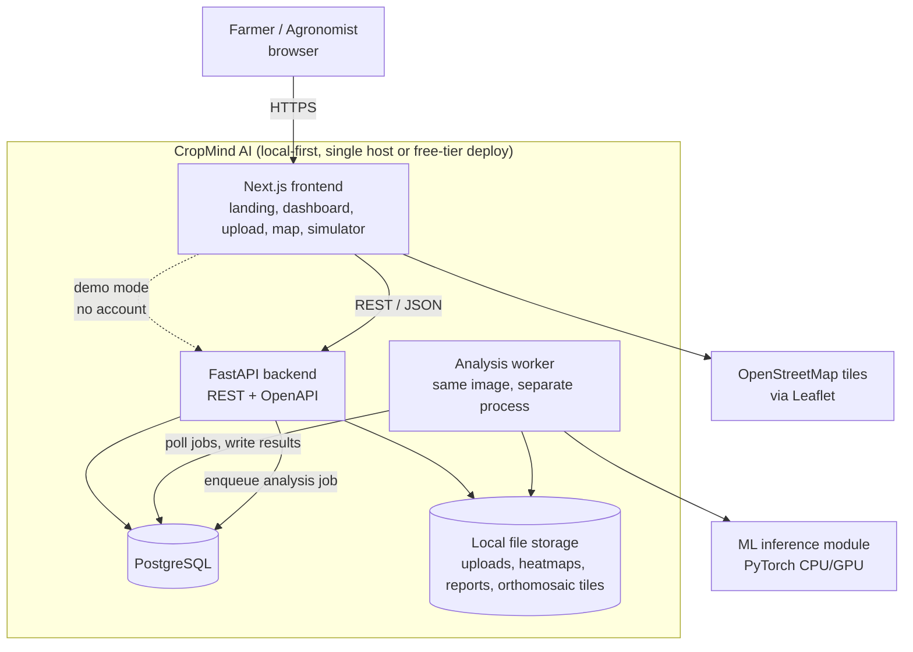
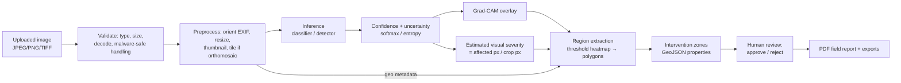
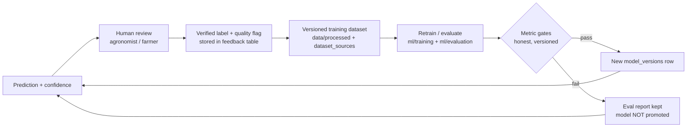

# 02 — System Architecture

**Status:** Draft v0.1 — Phase 0 (2026-08-08). Diagrams are Mermaid (render natively on GitHub).

---

## 1. System context



**Key property:** everything above runs from `docker compose up` with no paid services. Deployment
targets the same containers on free tiers.

## 2. Analysis pipeline



## 3. Feedback → data-strategy loop



This loop is the long-term moat: human-verified field data with provenance. It is presented as a
*future* advantage until real users contribute data and rights are established.

## 4. Technology choices

| Layer | Choice | Why | License |
|---|---|---|---|
| Frontend | Next.js (App Router) + TypeScript + Tailwind | fast product iteration, free Vercel deploy path, typed | MIT |
| Maps | Leaflet + OpenStreetMap | free, no API key lock-in, spec-mandated | BSD-2 / ODbL |
| Charts | Recharts (planned) | React-native, MIT | MIT |
| Backend | FastAPI + Pydantic v2 | typed REST, auto OpenAPI, async | MIT / MIT |
| DB | PostgreSQL 16 | ACID, JSONB for GeoJSON now, PostGIS later if needed | PostgreSQL Lic. |
| ORM/migrations | SQLAlchemy 2.0 + Alembic | SQL-injection-safe, versioned schema | MIT |
| Auth | JWT (PyJWT) + passlib/bcrypt (argon2 optional) | works fully offline, no paid IdP | MIT / BSD |
| Jobs | DB-backed job table + worker process (interface-compatible with Celery/RQ later) | zero extra infra locally; upgrade path preserved | — |
| ML | PyTorch + torchvision (MobileNetV3-Small baseline) | open weights, CPU-trainable, Colab/Kaggle-friendly | BSD-3 |
| Detection (Phase 4+) | torchvision Faster R-CNN **or** YOLOX | **both permissive** (BSD / Apache-2.0) | BSD / Apache-2.0 |
| Explainability | Grad-CAM over last conv layer (pytorch-grad-cam or in-house) | cheap, honest, classifier-native | MIT |
| PDF | ReportLab | open, no headless-browser dependency | BSD |
| Geospatial | shapely + pyproj + rasterio(optional), GeoJSON JSONB | no paid GIS | BSD / MIT |
| Tests | pytest, httpx, Playwright (e2e, Phase 11), Vitest (frontend) | standard, OSS | MIT/Apache |

### Decision: YOLO licensing (AD-005)
Ultralytics YOLOv8 is **AGPL-3.0/commercial dual license**. AGPL obligations (source offer on
network use, or a paid enterprise license) are a real business issue for a SaaS startup. Therefore:
- MVP detection will use **torchvision Faster R-CNN (BSD)** or **YOLOX (Apache-2.0)** — "YOLO-family
  architecture, permissively licensed implementation".
- Ultralytics may be added experimentally later only with an explicit AGPL/commercial-license decision
  recorded in `THIRD_PARTY_LICENSES.md`.

### Other ADRs
- **AD-001 Monorepo** — one repo, one CI, one founder; simpler versioning of cross-cutting phases.
- **AD-002 Local-first** — no product feature may require paid cloud services to run locally.
- **AD-003 JWT auth offline** — Supabase stay an *option*, never a requirement.
- **AD-004 DB-backed queue** — `analysis_jobs` table polled by worker; swap to Celery/RQ+Redis by
  config in production scale-up without touching the API contract (statuses PENDING/PROCESSING/COMPLETED/FAILED).
- **AD-006 GeoJSON-in-JSONB** — zones stored as GeoJSON in Postgres; PostGIS migration only when
  spatial queries demand it.
- **AD-007 No Google Maps** — Leaflet + OSM, with self-hostable tile option documented.
- **AD-008 Model registry** — weights never in git; `model_versions` table stores name, version,
  dataset version, threshold version, checksum, eval-report path. Every prediction references it.

## 5. Data model (Phase 5 target)

| Table | Purpose (key columns) |
|---|---|
| users | id, email, password_hash, role, created_at |
| farms | id, owner_id→users, name, location |
| fields | id, farm_id, name, crop_id, boundary_geojson, area_ha |
| images | id, field_id, uploader_id, path, thumb_path, captured_at, exif_json, source_type(SMARTPHONE/DRONE/DEMO) |
| analyses | id, image_id, field_id, status, job_id, requested_by, created_at, completed_at |
| predictions | id, analysis_id, model_version_id, crop, condition, confidence, uncertainty, severity, latency_ms |
| detection_regions | id, prediction_id, geometry_geojson, area_px, confidence |
| intervention_zones | id, analysis_id, zone_geojson, risk_level, condition, confidence, severity, est_area_ha, review_status(PENDING/APPROVED/REJECTED), reviewer_id |
| model_versions | id, name, version, dataset_version, threshold_version, checkpoint_uri, sha256, eval_report_uri, created_at |
| reports | id, analysis_id, report_id(human), pdf_path, generated_at |
| feedback | id, analysis_id, user_id, correctness(YES/NO/NOT_SURE), actual_condition, notes, image_quality, created_at |
| dataset_sources | id, name, version, source_url, license, license_url, image_count, classes_json, limitations, verified_at |
| audit_logs | id, user_id, action, entity, entity_id, ip, request_id, created_at |
| crops/diseases | config-driven taxonomy (id, name, description, dataset_source, supported_by_model, confidence_threshold) seeded from `ml/configs/` |

Relationships: users 1—n farms 1—n fields 1—n images 1—n analyses 1—n predictions 1—n detection_regions;
analyses 1—n intervention_zones, 1—1 report, 1—n feedback. Alembic migrations version every change.

## 6. API surface (FastAPI, REST)

Implemented per spec §28 — auth, farms, fields, images, analyses, predictions, intervention-zones,
feedback, reports (+download), health, model-info, supported-crops. Plus demo-mode aliases that skip
auth for sample data only. **Phase 5 delivered** health, model-info, supported-crops, images, analyses
and predictions (full contract in `docs/04-api-design.md`; FastAPI serves live OpenAPI at `/docs`);
auth, zones/feedback/reports routes land in Phases 7–10.

## 7. Background processing

- `POST /analyses` creates an `analysis_jobs` row (status PENDING) and returns **202 + analysis id** immediately.
- Worker (separate container/process, same codebase) polls, runs the ML pipeline, writes predictions,
  regions, heatmap files; on success COMPLETED, on exception FAILED with error context.
- Interface `JobQueue` (enqueue/poll/complete/fail) has a `LocalDbQueue` now; `CeleryQueue`/`RQQueue`
  are drop-in later (AD-004). Large orthomosaics: tiled processing with per-tile progress in the job row.

## 8. Hardware-extensible interfaces (implemented only as simulators)

```python
class DroneProvider(Protocol):
    def upload_mission(self, mission: MissionPlan) -> str: ...
    def get_telemetry(self, mission_id: str) -> Telemetry: ...
    def capture_imagery(self, mission_id: str) -> ImagerySet: ...
    def return_to_home(self, mission_id: str) -> None: ...

class FieldMappingProvider(Protocol):
    def field_boundary(self, field_id: str) -> GeoJSON: ...
    def imagery_to_geo(self, image_id: str, regions: list[Region]) -> list[GeoRegion]: ...

class SprayingMachineProvider(Protocol):
    def plan_route(self, zones: list[Zone], params: SprayParams) -> RoutePlan: ...
    def simulate_run(self, plan: RoutePlan) -> SimulationResult: ...

class TelemetryProvider(Protocol):
    def stream(self, mission_id: str) -> Iterable[Telemetry]: ...
```

Implementations in `simulation/`: `drone_simulator.py`, `spray_simulator.py`. Real vendor adapters
plug in behind the same Protocols without touching the API (Phase 5 roadmap item, post-MVP).

## 9. Security (summary — full doc Phase 11)

Input + file-type validation (magic bytes, not extension), size limits, safe filenames, image
re-encode before serving, ORM-only queries, JWT with short-lived access tokens, bcrypt hashes,
rate limiting on auth & upload, strict CORS allow-list, request IDs, audit logs, secrets only via
env. See `docs/08-security.md` when written.

## 10. Observability

Structured JSON logs with request_id + user_id; `/health` (liveness) + `/health/ready` (DB check);
analysis status queryable; per-inference latency persisted on `predictions.latency_ms`; worker
heartbeats in DB; eval reports archived per model version.

## 11. Environments

| Env | Purpose | Infra |
|---|---|---|
| local | daily dev | docker compose (postgres, backend, worker, frontend) |
| ci | GitHub Actions | service containers; no secrets beyond CI-scoped tokens |
| demo | evaluators / endorsers | free tier (Vercel + Render/Supabase), DEMO_MODE=true, sample imagery |
