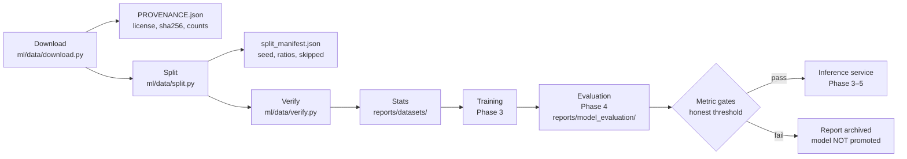

# 05 — ML Pipeline

**Status:** Data stage implemented (Phase 2, 2026-08-08). Training/evaluation/inference interfaces
land in Phases 3–4 per the roadmap; their design is recorded here so later work follows it.

---

## 1. Overview

## 2. Data stage (implemented)

| Step | Module | Contract |
|---|---|---|
| Registry | `ml/data/registry.py` | Machine mirror of docs/datasets.md: license id/url, page url, candidate download urls, notes. Downloads refuse URLs not in the registry. |
| Class mapping | `ml/data/classmap.py` | Normalizes mirror folder conventions → `disease_id` from `ml/configs/taxonomy.yaml`. Targets validated against the taxonomy in tests. Excluded (e.g. `Background_without_leaves`) and out-of-scope classes are recorded, never silently dropped. |
| Download | `ml/data/download.py` | License gate (`--accept-license`), ordered candidate URLs, PK-signature check, path-traversal-safe extraction, nested *without-augmentation* archive preference, `PROVENANCE.json`. Idempotent (caches archive). `AUTO_BLOCKED` sources (per-registry status) refuse fast with full manual-route guidance; HTTP 403 always fails fast — no retries, no access-control bypass. |
| Manual import | `ml/data/download.py#import_dataset` | `--archive` / `--directory` routes for user-acquired data: PK check, safe extract, structure gate (`verify_dataset_structure` vs registry expectations), sha256 where practical, identical PROVENANCE schema to auto-download. |
| Split | `ml/data/split.py` | Stratified, image-level, seed-audited (default 42, recorded), ratios recorded (default 70/15/15). Same seed ⇒ byte-identical `train/val/test.txt` + content sha. |
| Verify | `ml/data/verify.py` | Provenance required-keys, split counts vs manifest, file existence, duplicate detection, **cross-split leakage detection**. Non-zero exit on any problem. |
| Stats | `ml/data/stats.py` | Markdown + CSV per dataset in `reports/datasets/`: class × split counts, skipped folders, largest/smallest classes. Feeds docs/07-data-card.md. |

CLI: `python -m ml.data.cli {download|split|verify|stats|pipeline} --dataset …` (see `docs/datasets.md` for exact commands).

### Leakage posture (explicit decisions)

1. **Source-level:** training uses the without-augmentation PlantVillage archive only, because
   the augmented archive contains transformed duplicates that would contaminate val/test.
2. **Runtime-level (Phase 3):** augmentation happens inside the training transform on GPU/CPU,
   applied to the training split only; nothing is written back to `data/`.
3. **Check-level:** `verify_splits` fails CI if any path appears in more than one split.

## 3. Training stage (implemented, Phase 3)

- **Model:** MobileNetV3-Small (torchvision, ImageNet init) with replaced head → 21-class softmax
  from the taxonomy (`ml/training/model.py`, class order from `ml/training/classes.py` — sorted
  disease_ids, embedded in every checkpoint).
- **Runs:** `python -m ml.training.train --config ml/configs/train_v1.yaml`; every run writes
  `runs/<run_id>/` with config copy, per-epoch history, per-class P/R/F1 + held-out test metrics in
  `metrics.json`, and `checkpoint.pt` (state_dict + meta: class list, dataset version + splits
  content sha, seed, model_version) with sha256 sidecar.
- **Hardware posture:** one AdamW/cosine config runs CPU or CUDA (`device: auto`); augmentation is
  train-split-only runtime transforms (leakage policy §2). Early stopping on val top-1.
- **Sample checkpoint:** `python -m ml.training.sample_model` builds a clearly-labelled plumbing
  checkpoint (`0.0.0-sample`, synthetic patterns) for demo/inference wiring without a GPU.

## 4. Evaluation stage (Phase 4 — contract)

- Held-out PlantVillage test split: top-1, per-class P/R/F1, confusion matrix PNG.
- Out-of-domain PlantDoc evaluation (honesty metric, never tuned on).
- Latency: CPU inference time distribution (p50/p95) at 224px.
- Failure exemplars: top false positives/negatives saved for the model card.
- Output: `reports/model_evaluation/<model_version>/` — machine JSON + markdown + charts.
- Gates (M1, PRD §6): top-1 ≥ 0.80 in-domain; OOD number reported as-is; CPU p50 ≤ 2.5 s.

## 5. Inference stage (implemented, Phase 3 — `ml/inference/predictor.py`)

`Predictor(checkpoint, config_dir)` exposes `predict(image, explain_dir?) -> dict` with the full
contract: prediction_id, status (SUSPECTED/INCONCLUSIVE), phrasing ("Suspected {crop} - {name} -
{x}% confidence"), crop, condition, confidence, band, uncertainty (normalized predictive entropy),
estimated_visual_severity (Grad-CAM region fraction, labelled), regions, gradcam_overlay path,
model/dataset/threshold versions, latency_ms, timestamp, top_k, plus the fixed limitation notice
and explainability caveat. Bands load from `ml/configs/model.yaml` at init; below LOW ⇒ status
INCONCLUSIVE with retake/review advice. The backend worker (Phase 5) calls this module; the API
never loads weights directly.

## 6. Explainability stage (implemented, Phase 3 — `ml/explainability/gradcam.py`)

In-house Grad-CAM over the last features block (hooks; no OpenCV dependency), LUT overlay saved as
PNG, and coarse region extraction (grid-cell fraction above threshold → bbox + fraction, feeding
the visual-severity proxy). UI text is fixed and honest: *"Highlighted regions indicate areas that
contributed strongly to the model's prediction. They are not a guarantee of disease location."*

## 7. Versioning & reproducibility

Every prediction carries model name/version, dataset version, threshold version and timestamp
(spec §51) joined to the `model_versions`/`dataset_sources` tables (Phase 5) and to files under
`data/` via the provenance records above. Any reported metric must be reproducible from
`seed + taxonomy + manifest + checkpoint sha256`.

## Changelog

- v0.1 (2026-08-08): data stage implemented + future stage contracts written (Phase 2).
